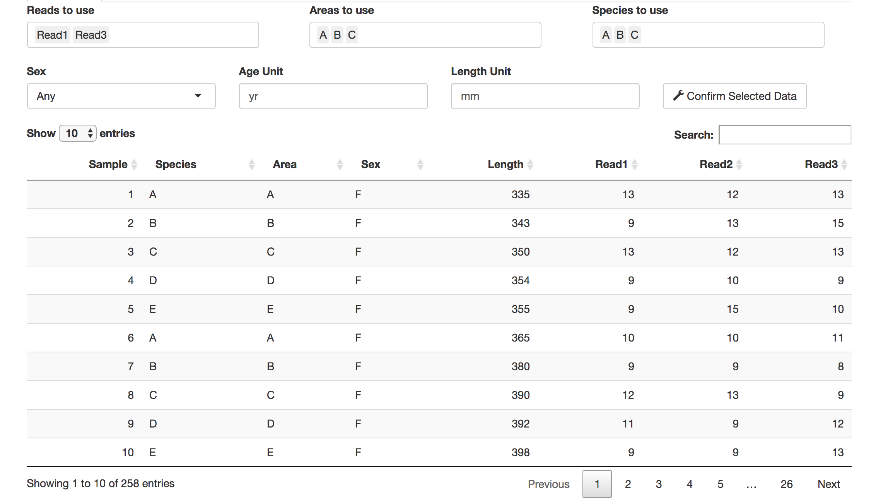
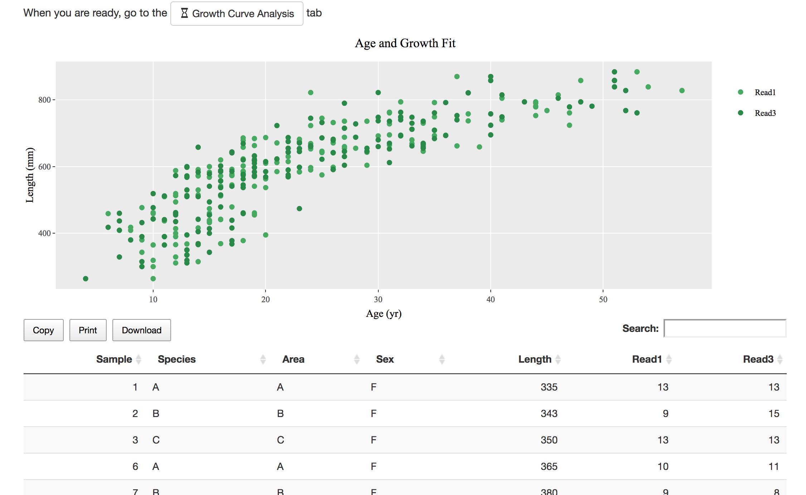
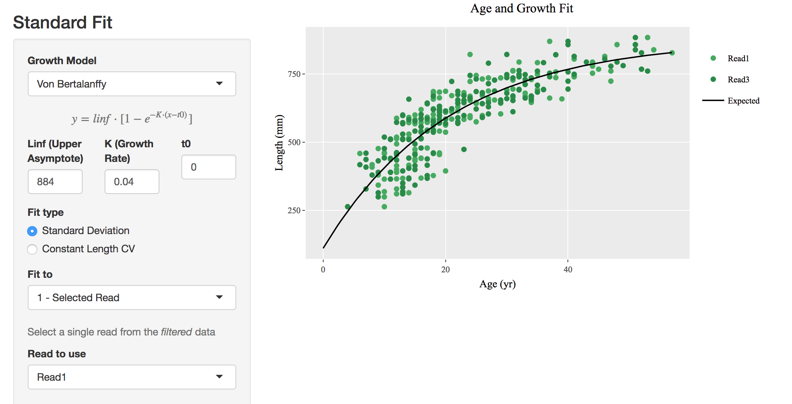
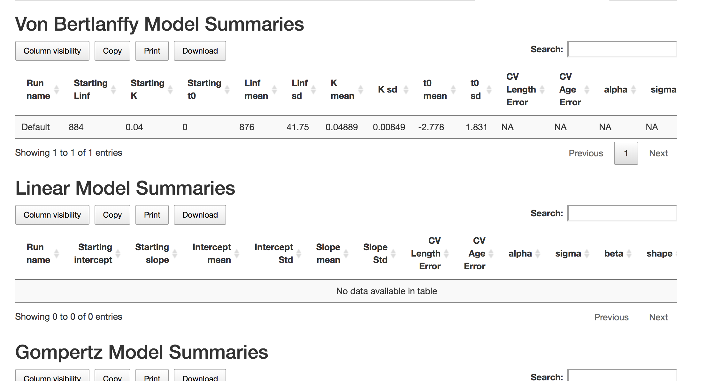
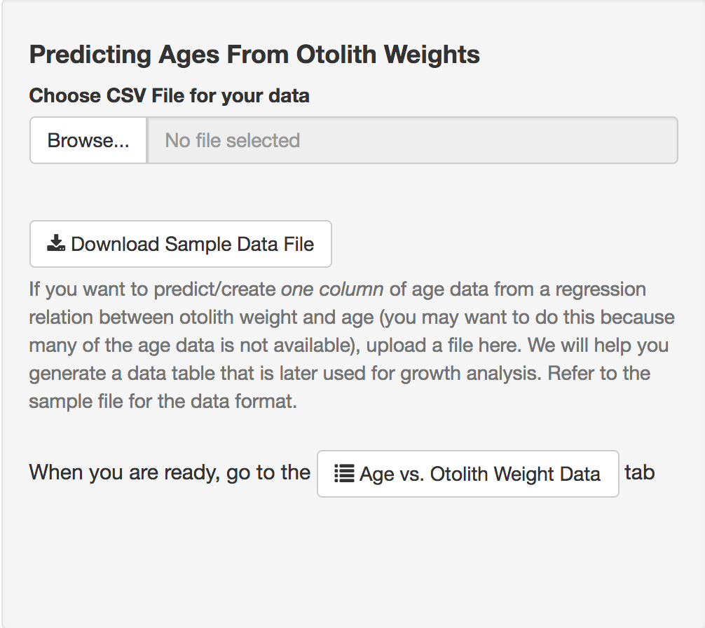
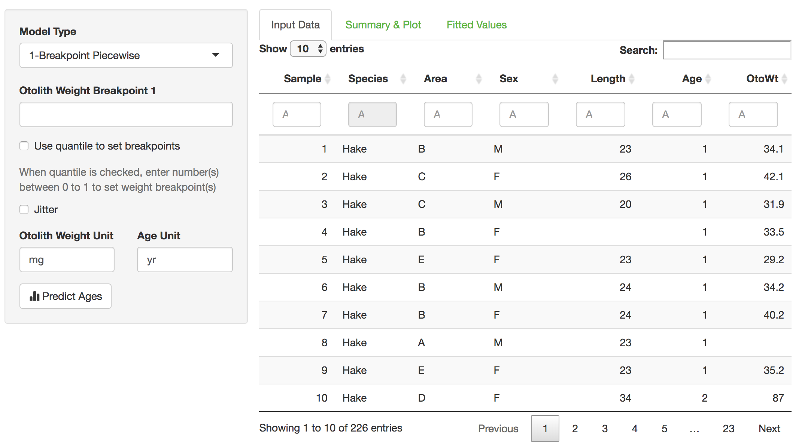
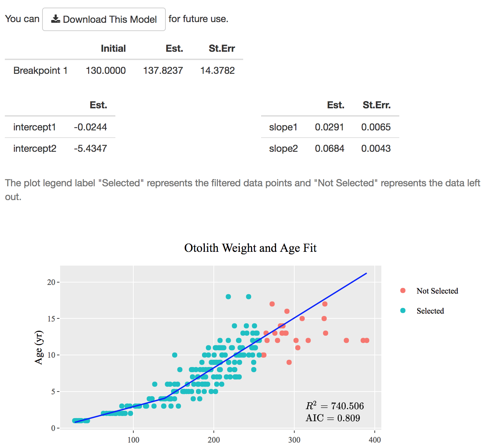
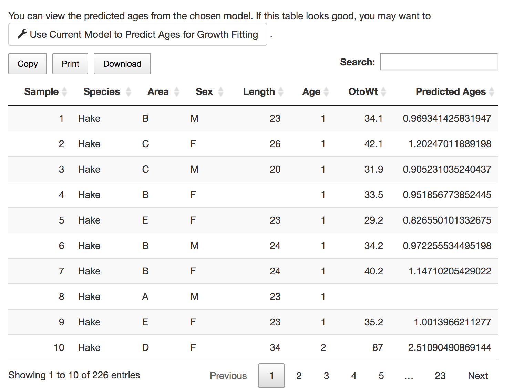
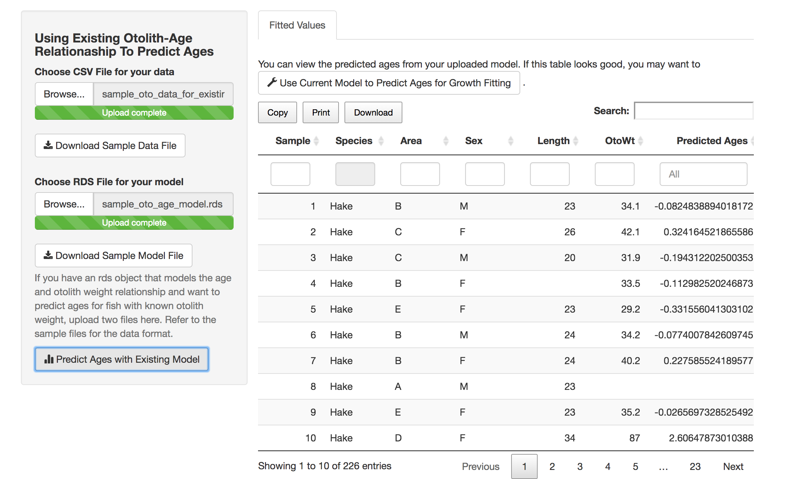

# IGOR+: Fitting Growth Curves with Random Effects

IGOR is an R Shiny tool that allows you to do the following tasks:
1. Estimate age and growth parameters for a variety of model (Gompertz, linear, logistic, Schnute, or von Bertalanffy).
2. Estimate an Otolith Weight vs. Age predictive model (linear or piecewise) with user data.
3. Use an existing Otolith Weight vs. Age model to predict ages for fish with known otolith weights.

## Prerequisite

Install TMB (https://github.com/kaskr/adcomp/wiki/Download) using the `install.packages("TMB")` command in the R terminal.
  
TMB requires the installation of Rtools, a program which contains a C++ compiler.
For Windows users, you should have Rtools installed. During installation, you need to edit the `PATH` variable to make sure that `c:\Rtools\bin;`, and `c:\Rtools\mingw_64\bin;` or `c:\Rtools\mingw_32\bin;` (64-bit or 32-bit version) are included in `PATH` as these directories contain the C++ gcc compiler. The command `Sys.getenv("PATH")` can be used in R to check you `PATH` variables. For futher directions, refer to [Install Rtools for Windows](https://github.com/kaskr/adcomp/wiki/Windows-installation).
  
For Mac users, you may need to install command line developer tools by running `xcode-select --install` in a terminal.

## How To Run The App

Download the Shiny_IGOR folder to a local directory. To run the app, you can:
1. Within RStudio, open the `ui.R`, `server.R`, or `global.R` files  and click the Run App button.
2. From an R terminal, type `R -e "shiny::runApp('~/path_to_this_shiny_app')"`. You should see something like `http://127.0.0.1:6108` (the port number is randomly selected), and then navigate your browser to that address.

## How Do I Run A Growth Curve Model Analysis?

There are two ways to feed in fish age and length data: 
1. There are two file upload panels when you start the app and to run a growth curve model analysis. You can upload a file with specified format as Length vs. Age data.
2. If you have run an Age vs. Otolith Weight model, you can use the predicted data as fish age and length data for this analysis.
  
The raw data from upload or predictions from otolith weight will show up in the Input Data tab under the Length vs. Age Data tab. You can then filter the data as you like and confirm the data choice. The filtered data will show up in the Selected Data tab under the Length vs. Age Data tab.

  
   

After you have selected your data, you can run a growth curve analysis with a model you like. A scatterplot and a fitting curve will show up on the right. The screenshot below shows a standard run with Von Bertlanffy Model. You can also run a model with random effects.

  

You can find out the results (parameter estimates) of your model runs in the Growth Curve Summaries tab.

  

## How Do I Run an Age vs. Otolith Weight Analysis?

  
   

When you start this app, you should see two panels for file upload. To run an Age vs. Otolith Weight model, you should upload a file with specified format in the panel shown above. Then in the Age vs. Otolith Weight Data tab, you would be able to see a control panel on the left hand side that provides you options for the model and your input data table on the right hand side.
  
After you choose the starting values for the model, you would see the result of the run in the Summary & Plot tab. You can also download the model for later use. In addition, the predicted ages will appear in the Fitted Values tab and you could this data for a growth curve analysis.

  
   

## How Do I Use An Existing Age vs. Otolith Weight Model To Predict Ages?

You now have an Age vs. Otolith Model and a data file that has otolith weights and you want to predict the ages for these fish. In the Use An Existing Otolith Weight vs. Age Model tab, you should see a file upload panel where you would upload an R object of type `lm` and a csv file that contains all your data. Your predicted ages will appear in a data table on the right.

  

